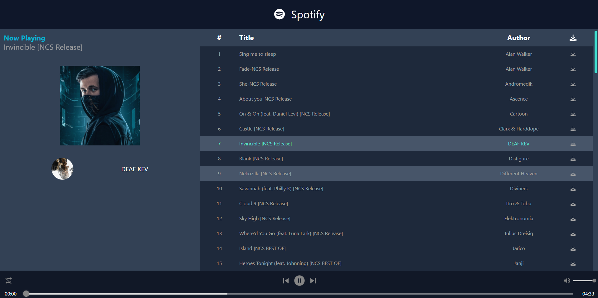

<p align="center">
 
</p>
<p align="center">
 <a href="https://tailwindcss.com/docs/" target="blank">
  
<!--      -->
  </a>
</p>

# Landing Page 2 Mode
<p align="center">
 <a href="https://react-tailwind-3-xi.vercel.app/landingPage" target="blank">
  Click link!!!
 </a>
 <video width="320" height="240" controls>
  <source src="./public/landingpage.mp4" type="video/mp4">
  Your browser does not support the video tag.
</video>
<!--      -->

</p>
 
 # Spotify
<p align="center">
 <a href="https://react-tailwind-3-xi.vercel.app/spotify" target="blank">
  
  </a>
</p>

# Install Tailwind <span></span>
```bash
npm install -D tailwindcss postcss autoprefixer
npx tailwindcss init -p
```
# Install React Icons
```bash
npm i react-icons --save
import { BsSunFill } from "react-icons/bs" -> bs means Bs
```

# Install React Spring ➡ text loading animation
```bash
npm i react-spring --save
```

# Install React Font Awesome
```bash
npm i -S @fortawesome/fontawesome-svg-core @fortawesome/react-fontawesome @fortawesome/free-regular-svg-icons @fortawesome/free-solid-svg-icons @fortawesome/free-brands-svg-icons
```

# Install MP3 Player
```bash
npm i react-h5-audio-player
```

# Copy into 'tailwind.config.js'
```javascript
module.exports = {
  content: [
    "./src/**/*.{js,jsx,ts,tsx}",
  ],
  theme: {
    extend: {},
  },
  plugins: [],
}
```


# Copy into 'index.css'
```css
@tailwind base;
@tailwind components;
@tailwind utilities;
```
# Build fix
```bash
 "build": "CI=false && react-scripts build",
```

# Passing Value Directly
prop-[...value]

# Width Classes
w-[100%]
# Height Classes
h-screen

# Padding Classes
pl, pr, pt, pb
px-{n} ➡ pl+pr
py-{n} ➡ pt+pb

# Margin Classes
- ml, mr, mt, mb
- mx-{n} ➡ ml+mr
- my-{n} ➡ mt+mb
- ml-auto
  
# Border 
rounded-{n}

# Color Classes 
bg-{color}-{n}

# Hover Classes
hover:{class-property}

# Overflow Classes
overflow-y-auto
overflow-x-hidden

# Transition Classes
transition-all duration-300

⚡️Linear gradients--
2 colors: 
- bg-gradient-to-{direction: r,l,t,b} from-{color}-{n} to-{color}-{n}
3 colors: 
- bg-gradient-to-{direction: r,l,t,b} from-{color}-{n} via-{color}-{n} to-{color}-{n}

# Responsive Classes 
- sm: 640
- md: 768
- lg: 1024
- xl: 1280
- 2xl: 1536

# Flex Classes
- flex | flex-(row|col)
- align-items ➡ items-(start / end / center / baseline / stretch)
- justify-content ➡ justify-(start /end /center /between /around /evenly)

# Can giua chieu ngang
text-center

# Grid Classes
grid gap-{n} grid-cols-{n} grid-rows-{n}

# Position Classes
relative 
absolute (top / bottom / left / right)-{n}
